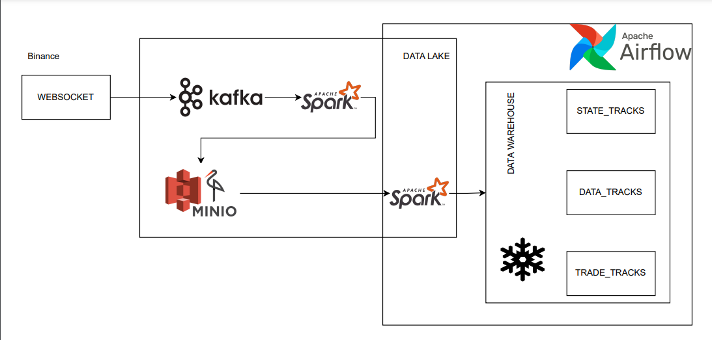
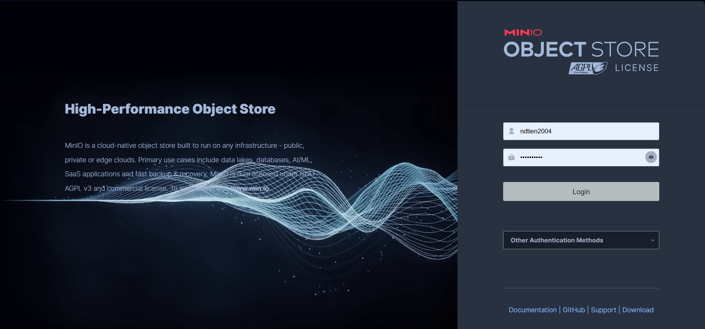
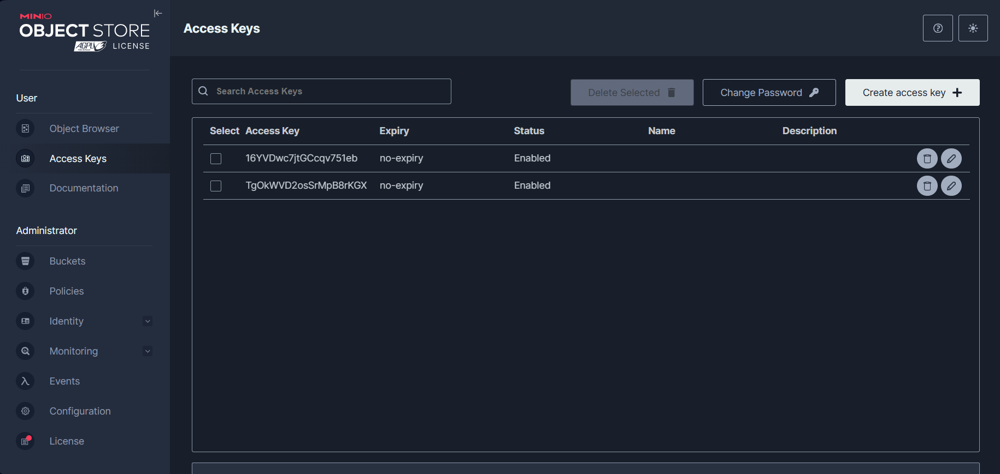
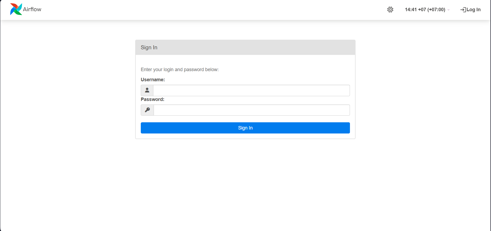
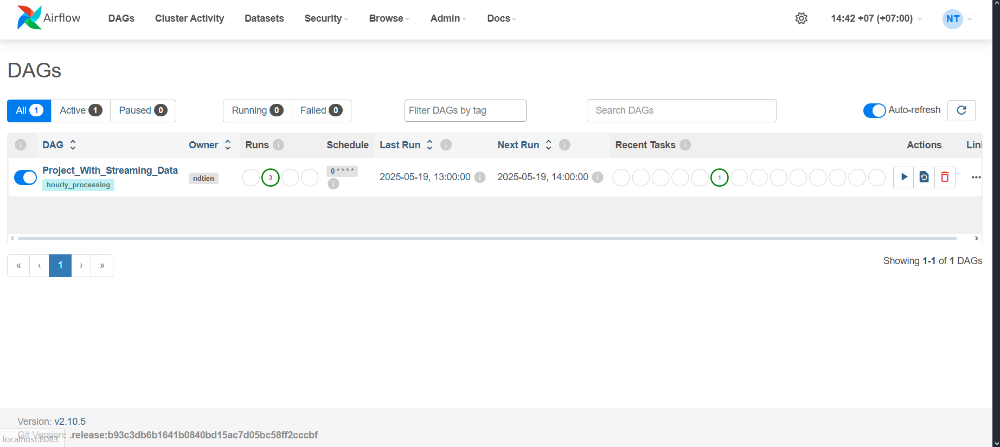
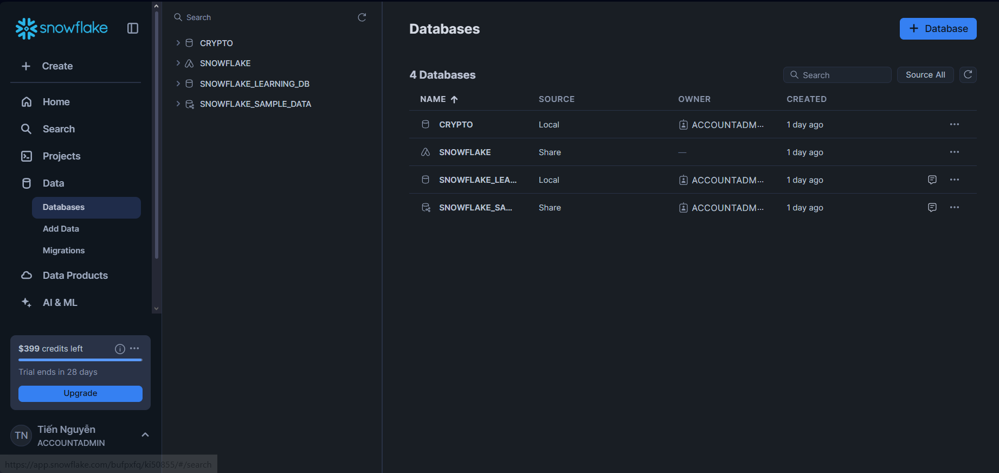
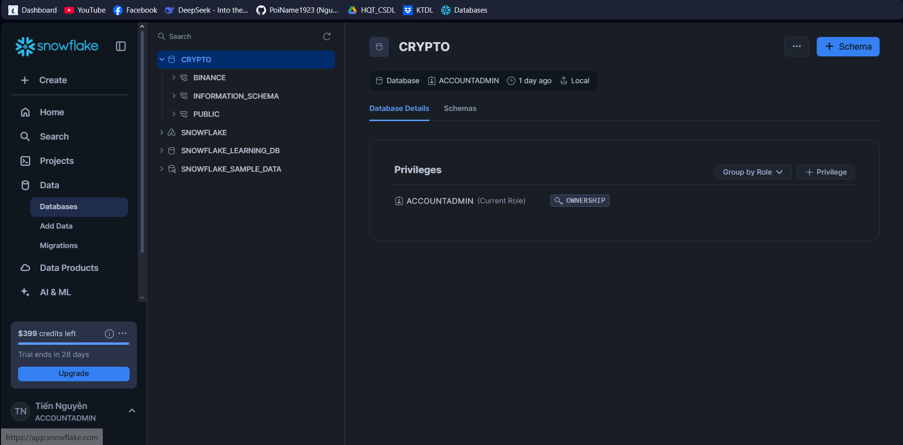
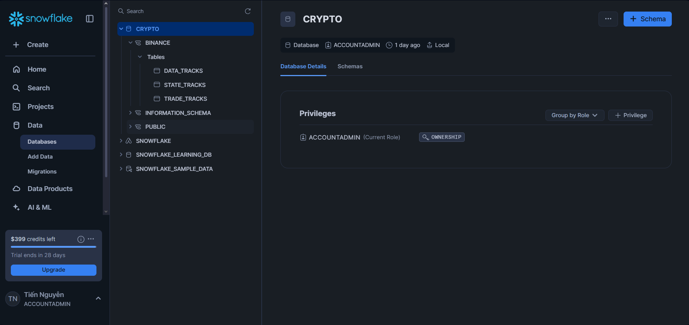

# Dự án Streaming Data Binance

## Mục Lục
- [Giới Thiệu](#Giới Thiệu)
- [Tính năng](#Tính năng)
- [Yêu cầu](#Yêu cầu)
- [Cài đặt](#Cài đặt)
- [Sử dụng](#Sử dụng)
- [Cấu trúc thư mục](#Cấu trúc thư mục)
- [Liên lạc](#Liên lạc)

## Giới thiệu:
Dự án này cung cấp công cụ thu thập và xử lý dữ liệu thị trường tiền điện tử theo thời gian thực từ Binance - một trong những sàn giao dịch tiền điện tử lớn nhất thế giới. Hệ thống sử dụng WebSocket API của Binance để lấy dữ liệu và xử lý qua nhiều giai đoạn trước khi lưu trữ vào Snowflake.


## Tính năng chính:
- Thu thập dữ liệu real-time từ Binance WebSocket API
- Xử lý dữ liệu cơ bản trước khi lưu trữ
- Lưu trữ dữ liệu vào CSDL Snowflake (dạng Star)

## Tính năng có thể mở rộng trong tương lai:
- Mô hình dự đoán giá của từng loại ticker.
- Trình bày cơ bản bằng Power BI.

## Yêu cầu:
- **Phần mềm bắt buộc**:
  - Docker Desktop (phiên bản 20.10.7 trở lên)
  - Git để clone repository
- **Cấu hình đề nghị**:
  - CPU: Tối thiểu 4 cores
  - RAM: Tối thiểu 8GB
  - Ổ cứng trống: Tối thiểu 10GB (Tồn tại ổ đĩa E:)

## Cài đặt:
Chạy lệnh sau để clone dự án về máy tính cá nhân từ **terminal** của máy tính cá nhân
```bash
# Clone the repository
git clone https://github.com/PoiName1923/Binance_Streaming.git
cd Binance_Streaming
```

## Sử dụng
### Bước 1: Khởi động dự án
- Đảm bảo dự Docker Desktop đã được khởi động.
- vào địa chỉ thư mục mà bạn đã code dự án về máy và nhập lệnh
```bash
docker-compose up -d --build
```
lệnh này sẽ tải về các container để chứa các công cụ cũng như là ứng dụng sẽ đảm nhận dự án hoạt động ổn thoả.

### Bước 2: Tạo Key, Bucket cho MiniO
#### Tạo key:
- Các bạn có thể sử dụng các trình duyệt như Chrome, Opera, Cốc Cốc, Microsoft Edge,... và nhập: **localhost:9000** sau đó nhấn **enter**.
- Lúc này một web đăng nhập vào MiniO sẽ hiện ra và bạn có thể đăng nhập bằng cách nhập tài khoảng mật khẩu mặc định là:
-- user: ndtien2004
-- password: ndtien2004
(hoặc bạn có thể chỉnh sửa theo cá nhân bằng cách điều chỉnh trong file docker-compose.yml)

- Tiếp đến tạo 2 key cho 2 tác vụ bằng cách nhấn ***Create Access Key*** và ghi lại 2 **Secret Key** và 2 **access key**


#### Tạo Bucket
- Ở thẻ **Object Browser** nếu chưa tồn tại bất kỳ Bucket nào hệ thống sẽ hiển thị dòng chữ **Create Bucket**, và bạn chỉ cần nhấp vào đó và tạo một bucket với tên **binance-data**

### Bước 3: Truyền Access, Secres Key cho Spark sử dụng.
- Ở địa chỉ **data_process/trans_process.py** bạn tìm đến dict **config** và tìm hai dòng sau và điền giá trị mà bạn đã tìm được ở bước 2. **"spark.hadoop.fs.s3a.access.key", "spark.hadoop.fs.s3a.secret.key"**

### Bước 4: Khởi động Airflow 
- Tiếp đến mở thêm 1 tabs trên ứng dụng trình duyệt mà bạn đã dùng để truy cập MiniO và nhập **localhost:8083**
- Nhập **username: ndtien**, và **password: ndtien** để truy cập vào Airflow.

- Tiếp đến bạn chỉ cần gạt công tắc khởi động cho **Project_With_Streaming_Data**


### Bước 5: Tạo tài khoản, database, schema Snowflake.
- Bước cuối cùng bạn cần truy cập: https://app.snowflake.com để tạo một tài khoảng Snowflake. Và thay đổi thông tin đăng nhập của **sf_options** trong file **data_process/loading_process.py**

- Tiếp đến bạn tìm đến thẻ: Data -> Databases .Để tạo database với tên **CRYPTO** bằng cách nhấn vào **Create Database**

- Từ Database CRYPTO tạo schema với tên **BINANCE** 

- Và từ schema **BINANCE** tạo 3 Table bằng cấu trúc trong file **create_tb_scripts_snowflake.sql** (nên tạo STATE TRACKS trước)


## Cấu trúc thư mục
```bash
.
├── dag/
│   ├── pipeline.py                         # Nơi cấu hình và xây dựng dags cho dự án
├── data/                                   # Lưu dữ liệu của cả dự án
├── data_process/
│   ├── kafka_product.py                    # Đảm nhận việc thu thập dữ liệu từ Binance và lưu vào Kafka (Bronze)
│   ├── loading_process.py                  # Phân chia, chuẩn hoá dữ liệu và tải lên snowflake (Gold)
│   └── trans_process.py                    # Xử lý dữ liệu (Silver)
├── docker/
│   ├── dockerfile.airflow                  # Cấu hình và xây dựng airflow cho dự án
│   ├── dockerfile.python                   # Cấu hình và xây dựng python cho dự án
│   └── requirements.txt                    # Chứa các thư viện cần thiết
├── images/                                 # Chứa các ảnh cho Readme.md
├── jars/                                   # Chứa các file jar để spark kết nối với Kafka, MiniO, Snowflake
├── .gitignore                              # Chứa các file mà git bỏ qua khi add
├── create_tb_scripts_snowflake.sql         # Chứa các lệnh tạo table
├── docker-compose.yml                      # Cấu hình thư mục dự án
└── README.md                               # Tài liệu mô tả dự án
```

## Liên lạc:
- Phone: 0377765389
- Email: nguyendinhtien23012004@gmail.com
- Facebook: https://www.facebook.com/poi.name (Nguyễn Tiến)
